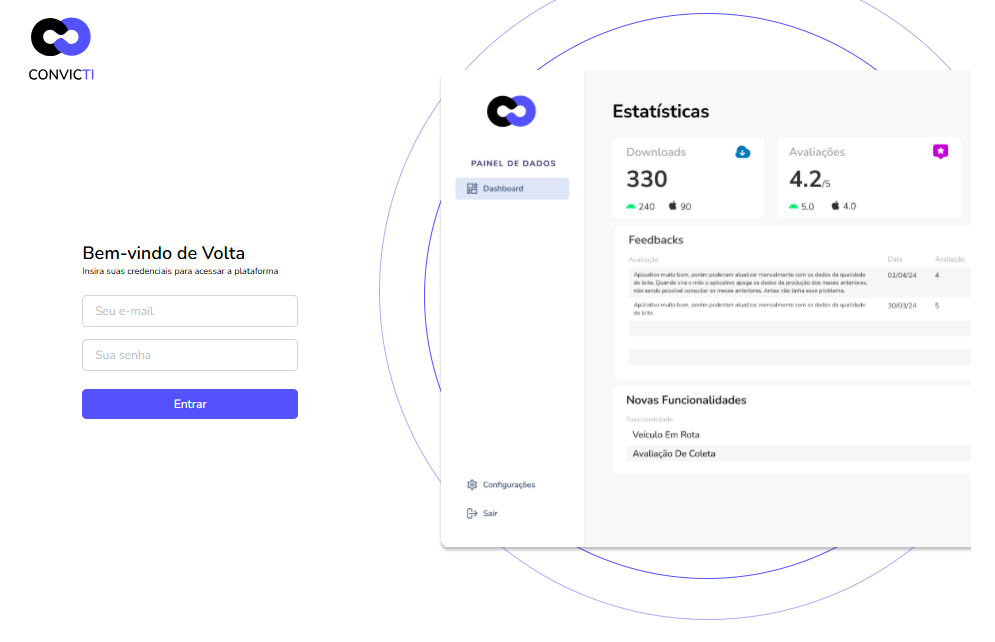
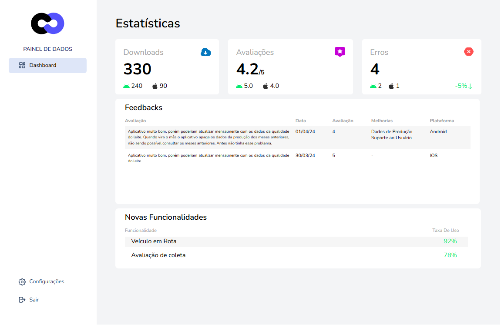
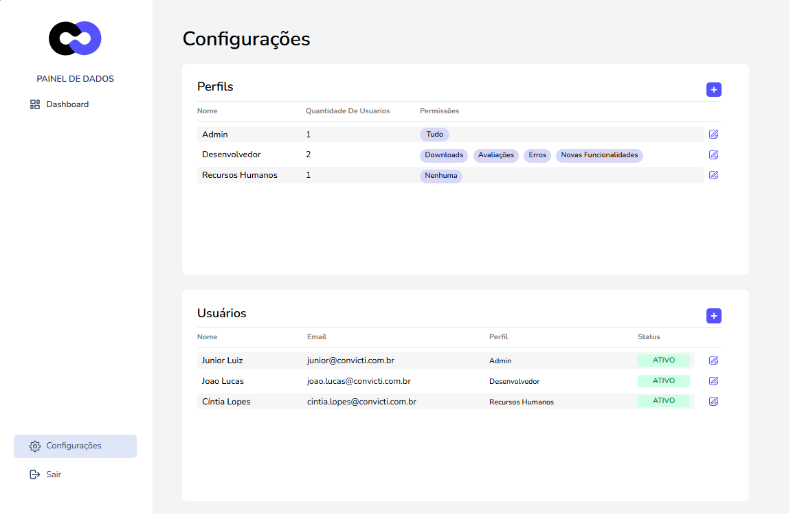

# Convicti - Teste Front-End

## 🚀 Descrição
O **Convicti** é um projeto desenvolvido com **Vue 3**, criado para oferecer uma visão detalhada das estatísticas de uso de uma aplicação. Ele utiliza tecnologias modernas para garantir uma experiência dinâmica e intuitiva, incluindo **Tailwind CSS** para estilização e a função `watch` do Vue para reatividade. Além disso, os dados de login são armazenados no `localStorage`, garantindo persistência entre sessões.

## 🛠️ Tecnologias Utilizadas
- **Vue 3**: Framework JavaScript para construção de interfaces de usuário interativas.
- **Tailwind CSS**: Biblioteca utilitária para um design responsivo e moderno.
- **localStorage**: API de armazenamento web para persistência de dados entre sessões.

## ▶️ Como Executar o Projeto
```bash
# Clone o repositório
git clone https://github.com/cassianobraz/CONVICTI-teste-frontend-junior.git

# Acesse o diretório do projeto
cd CONVICTI-teste-frontend-junior

# Instale as dependências
npm install

# Inicie o servidor de desenvolvimento
npm run dev
```

### 🌐 Acesse a versão online
O projeto está disponível no **Netlify**:  
🔗 <a href="https://convicti.netlify.app/" target="_blank" rel="noopener noreferrer">Convicti no Netlify</a>

## 🔀 Rotas de Acesso
- **Home**: `/`
- **Dashboard**: `/dashboard`
- **Configurações**: `/config`

## 📸 Demonstração das Telas
### 🛡️ Tela 1: Página de Login
- **Funcionalidade**: Permite login com email e senha.
- **Design**: Interface simples e intuitiva.
- **Persistência de Dados**: `access_token` salvo no `localStorage`.



### 📊 Tela 2: Dashboard
- **Estatísticas**: Exibe dados de downloads, avaliações e erros.
- **Feedbacks**: Mostra comentários dos usuários.
- **Novas Funcionalidades**: Exibição de recursos em desenvolvimento.



### ⚙️ Tela 3: Configurações
- **Perfis de Usuário**: Admin, Desenvolvedor e RH.
- **Gerenciamento de Usuários**: Listagem de usuários ativos.



## 💡 Desafios Enfrentados e Soluções

### 🔄 Persistência de Dados
- **Desafio**: Garantir que os dados de login fossem armazenados corretamente.
- **Solução**: Implementação do `localStorage` para manter o usuário autenticado.

### 🎨 Estilização Responsiva
- **Desafio**: Adaptar o design para diferentes dispositivos.
- **Solução**: Uso do Tailwind CSS para garantir flexibilidade no layout.

### 🔗 Gerenciamento de Rotas
- **Desafio**: Organizar as rotas de forma clara e eficiente.
- **Solução**: Implementação do Vue Router para navegação estruturada.

## 🎯 Conclusão
O projeto **Convicti** destaca minhas habilidades em:
- **Desenvolvimento Frontend Moderno**: Construção de interfaces dinâmicas com Vue 3.
- **Estilização Responsiva**: Aplicação eficiente do Tailwind CSS.
- **Persistência de Dados**: Uso estratégico do `localStorage`.
- **Arquitetura de Código Bem Definida**: Organização modular e otimizada.

## 📬 Contato
- **Nome**: Cassiano Braz
- **LinkedIn**: [Meu LinkedIn](https://www.linkedin.com/in/cassianobraz/)
- **Email**: cassanopb@gmail.com

## 📜 Licença
Este projeto está licenciado sob a [MIT License](LICENSE).
